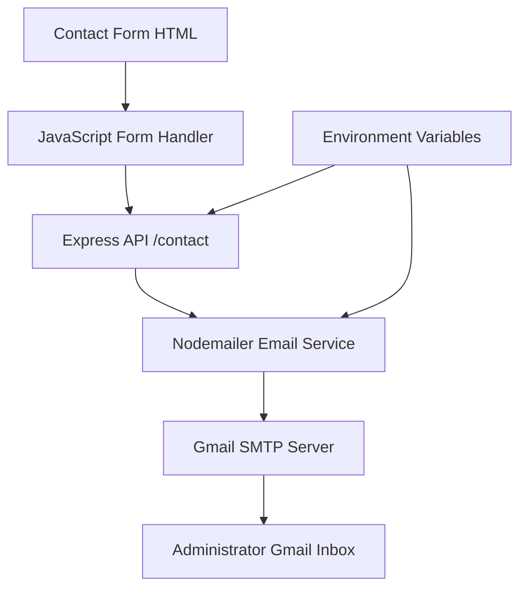

# Design Document: Contact Us System

## Overview

The Contact Us system is a full-stack web application feature that enables users to send messages through a contact form, which are then delivered to administrators via email. The system consists of a frontend HTML form with JavaScript handling, a Node.js/Express backend API, and Nodemailer integration for Gmail SMTP delivery.

## Architecture

The system follows a traditional client-server architecture with clear separation of concerns:



### Component Interaction Flow

1. **User Interaction**: User fills out contact form and submits
2. **Frontend Processing**: JavaScript validates form and sends JSON to API
3. **Backend Processing**: Express server receives, validates, and processes request
4. **Email Delivery**: Nodemailer authenticates with Gmail and sends email
5. **User Feedback**: Success/error response flows back to frontend

## Components and Interfaces

### Frontend Components

#### Contact Form  in a 
``

#### Form Handler (JavaScript)
```javascript
interface ContactFormData {
  name: string;
  email: string;
  message: string;
}

interface APIResponse {
  success: boolean;
  message?: string;
  error?: string;
}
```

### Backend Components

#### Express Server Configuration
```javascript
const express = require("express");
const nodemailer = require("nodemailer");
const cors = require("cors");

const app = express();
app.use(cors());
app.use(express.json());
```

#### Contact API Endpoint
```javascript
interface ContactRequest {
  body: {
    name: string;
    email: string;
    message: string;
  }
}

interface ContactResponse {
  success: boolean;
  message?: string;
  error?: string;
}
```

#### Email Service Configuration
```javascript
interface EmailConfig {
  service: "gmail";
  auth: {
    user: string;    // Gmail address
    pass: string;    // App-specific password
  }
}

interface EmailMessage {
  from: string;      // User's email
  to: string;        // Administrator email
  subject: string;   // Email subject
  text: string;      // Email body
}
```

## Data Models

### Contact Form Submission
```typescript
interface ContactSubmission {
  name: string;           // User's full name (1-100 characters)
  email: string;          // Valid email address
  message: string;        // Message content (1-2000 characters)
  timestamp?: Date;       // Submission timestamp (auto-generated)
  ipAddress?: string;     // User IP for rate limiting (optional)
}
```

### Email Template
```typescript
interface EmailTemplate {
  subject: string;        // "New Contact Form Message"
  body: {
    name: string;
    email: string;
    message: string;
    timestamp: Date;
  }
}
```

### Configuration Model
```typescript
interface SystemConfig {
  server: {
    port: number;         // Default: 3000
    corsOrigins: string[]; // Allowed frontend domains
  };
  email: {
    adminEmail: string;   // Administrator Gmail address
    smtpUser: string;     // Gmail SMTP username
    smtpPass: string;     // Gmail app password
  };
  security: {
    rateLimit: {
      windowMs: number;   // Rate limiting window
      maxRequests: number; // Max requests per window
    }
  }
}
```

Now I need to use the prework tool to analyze the acceptance criteria before writing the Correctness Properties section.
## Correctness Properties

*A property is a characteristic or behavior that should hold true across all valid executions of a system—essentially, a formal statement about what the system should do. Properties serve as the bridge between human-readable specifications and machine-verifiable correctness guarantees.*

After analyzing the acceptance criteria, I've identified the following testable properties that ensure system correctness:

### Property 1: Form Validation Consistency
*For any* combination of form field values, the validation result should be consistent - empty required fields should always fail validation, and complete valid fields should always pass validation.
**Validates: Requirements 1.2**

### Property 2: API Call Trigger
*For any* valid form data that passes validation, the form handler should always make an API call to the /contact endpoint.
**Validates: Requirements 1.3**

### Property 3: Success Feedback Display
*For any* successful API response, the contact form should always display a success message to the user.
**Validates: Requirements 1.4**

### Property 4: Error Feedback Display
*For any* failed API response, the contact form should always display an appropriate error message.
**Validates: Requirements 1.5**

### Property 5: Request Data Extraction
*For any* valid POST request to /contact, the API should successfully extract name, email, and message fields from the request body.
**Validates: Requirements 2.2**

### Property 6: API Input Validation
*For any* request data, the API validation should correctly identify missing or improperly formatted required fields.
**Validates: Requirements 2.3**

### Property 7: API Error Response
*For any* invalid request data, the API should return a structured error response with appropriate error details.
**Validates: Requirements 2.4**

### Property 8: Email Service Integration
*For any* valid contact data that passes API validation, the data should be forwarded to the email service.
**Validates: Requirements 2.5**

### Property 9: Email Composition
*For any* contact data received by the email service, an email should be composed containing all user information (name, email, message).
**Validates: Requirements 3.2**

### Property 10: Email Delivery
*For any* properly composed email, the email service should attempt to send it to the configured administrator address.
**Validates: Requirements 3.3**

### Property 11: Email Content Completeness
*For any* user contact data, the generated email should include the user's name, email, and message in a readable format.
**Validates: Requirements 3.4**

### Property 12: Email Success Response
*For any* successful email delivery, the email service should return a success confirmation.
**Validates: Requirements 3.5**

### Property 13: Email Error Response
*For any* failed email delivery attempt, the email service should return an appropriate error response.
**Validates: Requirements 3.6**

### Property 14: Authentication Error Handling
*For any* authentication failure with Gmail SMTP, the system should log the error and return a generic error message (not exposing credentials).
**Validates: Requirements 4.4**

### Property 15: Rate Limiting Protection
*For any* sequence of requests exceeding the configured rate limit, subsequent requests should be rejected until the rate limit window resets.
**Validates: Requirements 4.5**

### Property 16: End-to-End Flow Integrity
*For any* complete form submission, the system should maintain data integrity through the entire flow: Form → API → Email Service → Gmail.
**Validates: Requirements 5.1**

### Property 17: HTTP Header Correctness
*For any* form submission, the request should include proper JSON Content-Type headers.
**Validates: Requirements 5.2**

### Property 18: JSON Parsing Reliability
*For any* valid JSON request body, the API should parse it correctly without data loss or corruption.
**Validates: Requirements 5.3**

### Property 19: Email Format Consistency
*For any* contact submission, the generated email should have a consistent subject line format and structured content layout.
**Validates: Requirements 5.4**

### Property 20: System Feedback Completeness
*For any* step in the contact submission process, appropriate feedback should be provided to indicate success, failure, or processing status.
**Validates: Requirements 5.5**

### Property 21: Network Error Handling
*For any* network error during form submission, the form handler should display a user-friendly error message.
**Validates: Requirements 6.1**

### Property Server Error Response Structure
*For any* server error condition, the API should return a structured error response with consistent format.
**Validates: Requirements 6.2**

### Property 23: Error Logging Reliability
*For any* email delivery failure, the system should log the error details for administrator review.
**Validates: Requirements 6.3**

### Property 24: Duplicate Submission Prevention
*For any* form submission in progress, additional stempts should be prevented until the current submission completes.
**Validates: Requir.4**

### ty 25: Loading Indicator Behavior
*For any* form submission process, loading indicators should appear during processing and disappear when complete.
**Validates: Requirements 6.5**

## Error Handling

### Frontend Error Hng
- **Network Errors**: Display user-friendly messages for connection failures
- **Validation Errors**: Show field-specific validation messages
- **Ars**: Parse and display server error responses appropriately
- **Timeout Handling**: Implement request timeouts with retry options

### Backend Error Handling
- **Input Validation**: Return structured error responses for invalid data
- **Authentication Failures**: Log errors securely without exposing credentials
- **Email Service Errors**: Handle SMTP failures gracefully with fallback logging
- **Rate Limiting**: Return appropriate HTTP statusr rate limit viola
### Email Service Error Handling
- **SMTP Connection Errors**: Retry logic with exponential backofntication Errors**: Secure error logging and generic user messages
- **Delivery Failures**: Comprehensive error logging for administrator review
- **Configuration Errors**: Startup validation of email configuration

## Testing Strategy

### Dual Testing Approach
The system will use both unit testing and property-based testing for comprehensive coverage:

- **Unit Tests**: Verify specific examples, edge cases, and error conditions
- **Property Tests**: Verify universal properties across all inputs using generated test data
- **Integration Tests**: Test complete workflows from form submission to email delivery

### Property-Based Testing Configuration
- **Testing Library**: Use `fast-check` for JavaScript/Node.js property-based testing
- **Test Iterations**: Minimum 100 iterations per property test to ensure thorough coverage
- **Test Tagging**: Each property test will be tagged with format: **Feature: contact-us-system, Property {number}: {property_text}**

### Unit Testing Focus Areas
- Form validation with specific invalid inputs
- API endpoint error responses for known error conditions
- Email template formatting with edge case data
- CORS configuration with specific domain scenarios
- Rate limiting with specific request patterns

### Property Testing Focus Areas
- Form validation across all possible input combinations
- API data processing with randomly generated contact data
- Email composition with various user input formats
- Error handling across different failure scenarios
- End-to-end flow integrity with diverse test data

### Integration Testing
- Complete form submission to email delivery workflow
- Authentication and SMTP connection testing
- Cross-browser compatibility for frontend components
- Performance testing under various load conditions

### Test Environment Setup
- Mock Gmail SMTP for unit tests to avoid sending real emails
- Test Gmail account for integration testing
- Environment variable configuration for different test scenarios
- Automated test execution in CI/CD pipeline